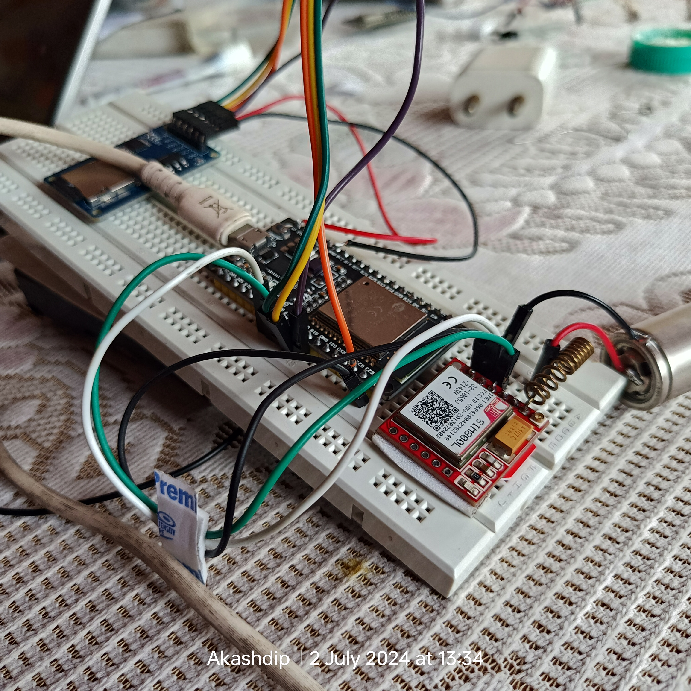
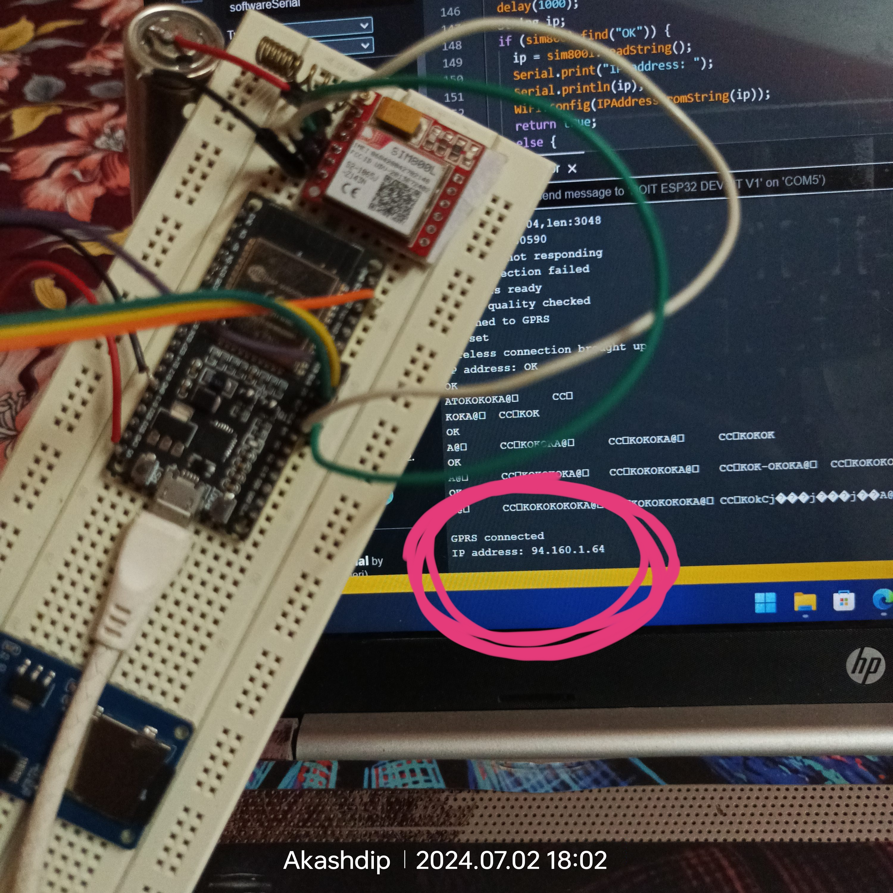
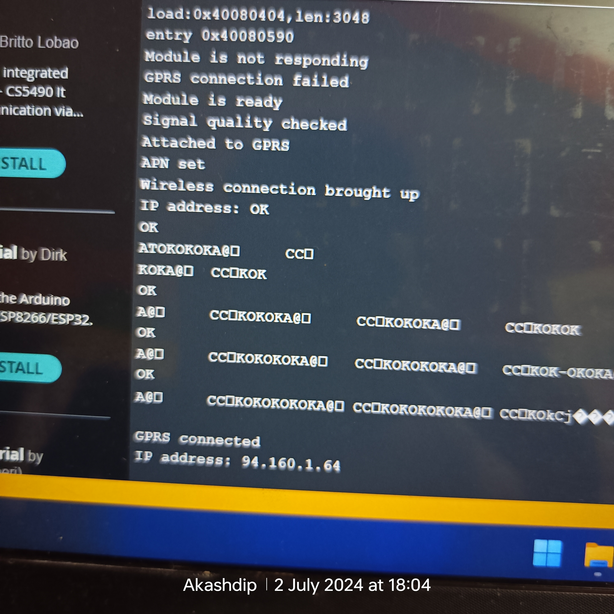

<p float="left">
  
</p>

# ESP32-host-HTML-website

# ✅ HTML in CPP

```cpp
#include <WiFi.h>
#include <WebServer.h>

const char* ssid = "YourHotspotSSID";
const char* password = "YourHotspotPassword";

WebServer server(80);

void setup() {
    Serial.begin(115200);

    // Connect to Wi-Fi
    WiFi.begin(ssid, password);
    while (WiFi.status() != WL_CONNECTED) {
        delay(1000);
        Serial.println("Connecting to WiFi...");
    }
    Serial.println("Connected to WiFi");

    // Print ESP32 local IP address
    Serial.println(WiFi.localIP());

    // Route for root / web page
    server.on("/", HTTP_GET, [](){
        server.send(200, "text/plain", "Hello from ESP32!");
    });

    // Start server
    server.begin();
    Serial.println("HTTP server started");
}

void loop() {
    server.handleClient();
}

```

# big HTML => CPP & using as array[] [video](https://youtu.be/CPCTf20Sbvw)

<p float="left">
  
  
</p>


# ✅ HTML => PowerShell with .NET Classes

```kotlin
/YourSketchFolder
├── YourSketchName.ino
├── data
│   ├── index.html
│   ├── style.css
│   └── script.js
```

move => Arduino IDE => File => Preferences => SketchBook Location => where 📁 "sketch_jun28a.ino" <br />
& convart the index.html => index_html_gz.h using PowerShell

<p float="left">
  
  
</p>

```powershell
$inputFile = "C:\Users\akash\OneDrive\Documents\Arduino\data\index.html.gz"
$outputFile = "C:\Users\akash\OneDrive\Documents\Arduino\sketch_jun28a\index_html_gz.h"

$fileBytes = [System.IO.File]::ReadAllBytes($inputFile)

$hexString = "const unsigned char index_html_gz[] PROGMEM = {" + [System.Environment]::NewLine
$hexArray = @()

foreach ($byte in $fileBytes) {
    $hexArray += "0x" + $byte.ToString("X2")
}

$hexString += ($hexArray -join ", ") + [System.Environment]::NewLine
$hexString += "};" + [System.Environment]::NewLine
$hexString += "const int index_html_gz_len = sizeof(index_html_gz) / sizeof(index_html_gz[0]);" + [System.Environment]::NewLine

$hexString | Out-File -FilePath $outputFile -Encoding ASCII
```
<p float="left">
  
  
</p>

```cpp
#include <WiFi.h>
#include <WebServer.h>
#include "index_html_gz.h" // Include the generated header file

const char* ssid = "spa";
const char* password = "12345678";

WebServer server(80);

void setup() {
    Serial.begin(115200);

    // Connect to Wi-Fi
    WiFi.begin(ssid, password);
    while (WiFi.status() != WL_CONNECTED) {
        delay(1000);
        Serial.println("Connecting to WiFi...");
    }
    Serial.println("Connected to WiFi");

    // Print ESP32 local IP address
    Serial.println(WiFi.localIP());

    // Route for root / web page
    server.on("/", HTTP_GET, [](){
        server.sendHeader("Content-Encoding", "gzip");
        server.send_P(200, "text/html", reinterpret_cast<const char*>(index_html_gz), index_html_gz_len);
    });

    // Start server
    server.begin();
    Serial.println("HTTP server started");
}

void loop() {
    server.handleClient();
}
```

in Bionary [index_html_gz.h (Generated header file):]

<p float="left">
  
</p>
<p float="left">
  
  
</p>

# alternate process (use .h file without directly convert using cmd) [video](https://youtu.be/eHxkZ7poKHc)

advantage of this process - it's suitable for using javascript 


# ❌ HTML in ESP32's SPIFFS (SPI Flash File System)

goTo [GitHub:](https://github.com/me-no-dev/arduino-esp32fs-plugin) => [Releases](https://github.com/me-no-dev/arduino-esp32fs-plugin/releases/tag/1.1) => download ESP32FS-1.1.zip <br />
IDE => Files => Preferences => ScatchBook Location => create filder "tools" => copy-pest the folder 📂"ESP32FS" => Restart the IDE

# guide [video_1](https://youtu.be/0ox1oF9pSus) , [video_2](https://youtu.be/LcMVoKb1NhE)

If you're encountering a "404 Not Found" error when trying to access `http://192.168.150.165/`, it typically indicates that the server (your ESP32 in this case) is running and reachable, but it couldn't find the requested resource (`index.html` or any other file you specified). Here are a few steps to troubleshoot and resolve this issue:

### Steps to Troubleshoot:

1. **Check SPIFFS Upload:**
   - Ensure that you have successfully uploaded your `index.html` file and any other necessary files to SPIFFS. Use the SPIFFS upload tool in Arduino IDE or PlatformIO to verify that the files are indeed transferred to the ESP32.

2. **Verify File Path:**
   - Double-check the path and filename used in your `server.on("/", ...)` handler. Ensure that it matches exactly with the file name (`index.html`) and path in SPIFFS where you uploaded it.

3. **Serial Monitor Output:**
   - Review the serial monitor output for any errors or messages indicating issues with SPIFFS initialization or file serving.

4. **HTTP Request Handling:**
   - Confirm that the server is correctly handling HTTP requests. In your case, the handler should respond to requests to the root path ("/") with the `index.html` file.

### Adjusted Code Example:

```cpp
#include <WiFi.h>
#include <AsyncTCP.h>
#include <ESPAsyncWebServer.h>
#include <SPIFFS.h>

// Replace with your network credentials
const char* ssid = "your_SSID";
const char* password = "your_PASSWORD";

AsyncWebServer server(80);

void setup() {
    Serial.begin(115200);
    delay(1000); // Allow time for serial monitor to open

    // Connect to Wi-Fi
    Serial.println();
    Serial.print("Connecting to Wi-Fi...");
    WiFi.begin(ssid, password);
    while (WiFi.status() != WL_CONNECTED) {
        delay(1000);
        Serial.print(".");
    }
    Serial.println("Connected to WiFi");

    // Print ESP32 local IP address
    Serial.print("IP Address: ");
    Serial.println(WiFi.localIP());

    // Initialize SPIFFS
    if (!SPIFFS.begin(true)) {
        Serial.println("An error occurred while mounting SPIFFS");
        return;
    }
    Serial.println("SPIFFS initialized");

    // Route for root / web page
    server.on("/", HTTP_GET, [](AsyncWebServerRequest *request){
        request->send(SPIFFS, "/index.html", "text/html");
    });

    // Start server
    server.begin();
    Serial.println("HTTP server started");
}

void loop() {
    // Keep the server running
    // Not much to do here, but keep the server alive
}
```

### Additional Checks:

- **Clear Cache:** Sometimes browsers cache 404 errors. Clear your browser cache or try accessing the IP address from a different browser or incognito/private window.
  
- **Check IP Address:** Ensure that the IP address printed in the serial monitor (`Serial.println(WiFi.localIP())`) matches the one you're trying to access in the browser.

- **Network Configuration:** If the problem persists, check your network configuration and ensure there are no firewall rules or network settings preventing access to the ESP32.

By following these steps and ensuring everything is configured correctly, you should be able to resolve the "404 Not Found" error and successfully access your ESP32 hosted web page at `http://192.168.150.165/`. <br />
output

```
Connecting to Wi-Fi........Connected to WiFi
IP Address: 192.168.150.165
SPIFFS initialized
HTTP server started
```


# ✅✅✅ using SD Card ♦️ module [my video ⤵️](https://youtu.be/ySJt3QGyr9w)

<p float="left">
  
</p>

# [my video ⤴️](https://youtu.be/ySJt3QGyr9w) Complete explain the project 

# guide [video_1](https://youtu.be/JxjZXf7veMM) , [video_2](https://youtu.be/naZYr5vY4Sg) , [video_3](https://youtu.be/mFsLlakhVL8)

To host a website using your ESP-WROOM-32 module and a microSD card, you can follow these general steps:

```
ESP-WROOM-32                    MicroSD Card Module
  |                                  |
  | CS (GPIO X) ---------------------| CS
  | SCK (GPIO Y) --------------------| SCK
  | MOSI (GPIO Z) -------------------| MOSI
  | MISO (GPIO W) -------------------| MISO
  | 3.3V ----------------------------| VCC (or 3.3V)
  | GND -----------------------------| GND
```


### CODE

```cpp
#include <WiFi.h>
#include <SPI.h>
#include <SD.h>
#include <ESPAsyncWebServer.h>

// Pin Definitions
#define SD_CS    5   // Replace with the GPIO pin number connected to CS of microSD card module
#define SD_SCK   18  // Replace with the GPIO pin number connected to SCK of microSD card module
#define SD_MOSI  23  // Replace with the GPIO pin number connected to MOSI of microSD card module
#define SD_MISO  19  // Replace with the GPIO pin number connected to MISO of microSD card module

const char* ssid = "spa";
const char* password = "12345678";

AsyncWebServer server(80);

void setup() {
  // Initialize Serial and SD card
  Serial.begin(115200);
  
  // Print Wi-Fi connection details
  Serial.print("Connecting to ");
  Serial.println(ssid);

  // Connect to Wi-Fi
  WiFi.begin(ssid, password);
  int tries = 0;
  while (WiFi.status() != WL_CONNECTED) {
    delay(1000);
    Serial.print(".");
    tries++;
    if (tries > 20) {
      Serial.println("Failed to connect to WiFi");
      break;
    }
  }

  if (WiFi.status() == WL_CONNECTED) {
    Serial.println("");
    Serial.println("WiFi connected");
    Serial.print("IP address: ");
    Serial.println(WiFi.localIP());
  } else {
    Serial.println("WiFi connection failed");
    return;
  }

  // Initialize SD card
  if (!SD.begin(SD_CS)) {
    Serial.println("Card Mount Failed");
    return;
  }
  
  // Check if index.html exists
  if (!SD.exists("/index.html")) {
    Serial.println("index.html missing");
    return;
  }

  // Route for serving files from SD card
  server.onNotFound([](AsyncWebServerRequest *request){
    String path = request->url();

    // Check if SD card is still connected
    if (!SD.begin(SD_CS)) {
      request->send(503, "text/html", "<html><body><h1>SD card not connected</h1></body></html>");
      return;
    }

    // Serve index.html by default if path ends with '/'
    if(path.endsWith("/")) path += "index.html";

    String contentType = "text/plain";
    if(path.endsWith(".html")) contentType = "text/html";
    else if(path.endsWith(".css")) contentType = "text/css";
    else if(path.endsWith(".js")) contentType = "application/javascript";

    File file = SD.open(path.c_str());
    if(file){
      request->send(SD, path.c_str(), contentType);
      file.close();
    } else {
      request->send(404, "text/html", "<html><body><h1>File not found</h1></body></html>");
    }
  });

  // Start server
  server.begin();
}

void loop() {
  // Nothing to do here
}

```
<p float="left">
  
  
</p>

to make it portable using lithium ion batteries - and connect it with 5 voltage ⚡ pin in is ESP32 , BECAUSE IN THE SD CARD MODULE THERE WAS A VOLTAGE IC . otherwise you can supply 3 voltage from ESP32


<p float="left">
  
</p> 


# LAN => WAN (Port Forward)

If you don't have a 🌐 router and want to port forward directly through a mobile hotspot on your Windows PC, the process is more complex because most mobile carriers do not support port forwarding due to the way mobile networks handle IP addresses and NAT (Network Address Translation). However, there are workarounds that might help you achieve similar results.

### Using a VPN with Port Forwarding

1. Find a VPN Service that Supports Port Forwarding:
   - Some VPN services offer port forwarding as part of their features. Examples include PureVPN, Private Internet Access (PIA), and AirVPN.

2. Sign Up and Install the VPN:
   - Sign up for the VPN service.
   - Download and install the VPN client on your Windows PC.

3. Configure Port Forwarding in the VPN:
   - Follow the VPN provider’s instructions to set up port forwarding. This usually involves logging into your VPN account, selecting a port to forward, and configuring the VPN client.

4. Connect to the VPN:
   - Use the VPN client to connect to a server that supports port forwarding.
   - Note the external IP address provided by the VPN.

5. Adjust Windows Firewall Settings:
   - Ensure the Windows firewall allows traffic through the forwarded port:
     - Open Control Panel.
     - Go to System and Security > Windows Defender Firewall > Advanced Settings.
     - Click on Inbound Rules, then New Rule.
     - Choose Port, then Next.
     - Select TCP, enter the port number, and click Next.
     - Allow the connection, then click Next.
     - Choose when to apply this rule (Domain, Private, Public), then click Next.
     - Give the rule a name and click Finish.

6. Test the Connection:
   - Use a tool like [CanYouSeeMe](http://canyouseeme.org) to verify that the port is open and accessible.

### 🌐 Using a Remote Server as a Proxy

Another approach is to use a remote server to act as a proxy for your local device. This involves setting up a server (such as a VPS) that forwards traffic to your local device.

1. Set Up a VPS:
   - Sign up for a VPS (Virtual Private Server) with a provider like DigitalOcean, AWS, or Linode.

2. Configure SSH Tunneling:
   - Use SSH tunneling to forward traffic from the VPS to your local device.
   - Open Command Prompt on your Windows PC.
   - Use an SSH client like OpenSSH or PuTTY to create a tunnel. For example:
    
     ```
     ssh -R [VPS_PORT]:localhost:[LOCAL_PORT] [VPS_USER]@[VPS_IP]
     ```
     
     Replace [VPS_PORT] with the port you want to forward on the VPS, [LOCAL_PORT] with the local port your NodeMCU service is using, [VPS_USER] with your VPS username, and [VPS_IP] with your VPS IP address.

3. Access Your Service:
   - Access your service using the VPS IP and forwarded port.

### 🌐 Using Ngrok

Ngrok is a tool that creates secure tunnels to your localhost, making it accessible over the internet.

1. Install Ngrok:
   - Download and install Ngrok from [ngrok.com](https://ngrok.com).

2. Set Up Ngrok:
   - Open Command Prompt.
   - Run the following command to create a tunnel to your local port:
    
     ```
     ngrok http [LOCAL_PORT]
     ```
     
     Replace [LOCAL_PORT] with the port your NodeMCU service is using.

3. Access Your Service:
   - Ngrok will provide a public URL that you can use to access your local service.

By using one of these methods, you can achieve port forwarding or similar functionality without needing a traditional router.

Ngrok is too costly, you can consider some free alternatives that offer similar tunneling services. Here are a few options:

### 🌐 LocalTunnel

LocalTunnel provides a simple way to expose a local server to the internet. It’s free and easy to set up.

1. Install LocalTunnel:
   - Open Command Prompt.
   - Install LocalTunnel using npm (you need Node.js installed):
  
    ```sh
     npm install -g localtunnel
    ```
    
2. Start LocalTunnel:
   - Run the following command to create a tunnel:
     
     ```sh
     lt --port [LOCAL_PORT]
     ```
     
     Replace [LOCAL_PORT] with the port your NodeMCU service is using.

4. Access Your Service:
   - LocalTunnel will provide a public URL that you can use to access your local service.

### 🌐 Serveo

Serveo is a free SSH-based tunneling service.

1. Set Up Serveo:
   - Open Command Prompt.
   - Run the following command:
    
     ```sh
     ssh -R 80:localhost:[LOCAL_PORT] serveo.net
     ```
     
     Replace [LOCAL_PORT] with the port your NodeMCU service is using.

2. Access Your Service:
   - Serveo will provide a public URL that you can use to access your local service.

### 🌐 Telebit

Telebit is another free service for exposing your local server to the internet.

1. Install Telebit:
   - Open Command Prompt.
   - Install Telebit using npm (you need Node.js installed):
    
     ```sh
     npm install -g telebit
     ```
     
2. Configure Telebit:
   - Run the following command to configure Telebit:
    
     ```sh
     telebit init
     ```
     
   - Follow the prompts to set up your Telebit account and configuration.

3. Start Telebit:
   - Run the following command to start the tunnel:
    
     ```sh
     telebit http [LOCAL_PORT]
     ```
     
     Replace [LOCAL_PORT] with the port your NodeMCU service is using.

4. Access Your Service:
   - Telebit will provide a public URL that you can use to access your local service.

These alternatives provide free options to expose your local services to the internet, similar to Ngrok but without the cost.


# Diractly connect your SD-card to internet 🛜 using 4G LTE GSM (SIM800L)

<p float="left">
  
  
</p>

To connect your ESP32 to the internet using the SIM800L module and make your website accessible globally, you'll need to configure the ESP32 to communicate with the SIM800L and establish a GPRS connection. Below is an outline of the steps and the modified code to achieve this.

### Requirements:

  - ESP32 board.
  - SIM800L module with a valid SIM card and data plan.
  - Connection wires and power supply for the SIM800L module.

### Wiring:

  - SIM800L -> ESP32VCC -> 3.7V (ensure proper voltage for SIM800L)
  - GND -> GND
  - TXD -> RX (GPIO 16)
  - RXD -> TX (GPIO 17)

# Power supply => SIM 800L => 4.2 v

### Components Needed
   - ( R1 ) = 1.6kΩ resistor
   - ( R2 ) = 8.4kΩ resistor
   
### Circuit Diagram

```cpp
   5V
    |
   [R1]
    |
   Vout (4.2V)
    |
   [R2]
    |
   GND
```

# or

### Components Needed

   - ( R1 ) = 1.5kΩ resistor
   - ( R2 ) = 8.2kΩ resistor
   
### Circuit Diagram

```cpp
   5V
    |
   [R1] (1.5kΩ)
    |
   Vout (4.225V)
    |
   [R2] (8.2kΩ)
    |
  GND
```

<p float="left">
  
</p>

### Code:

```cpp
#include <WiFi.h>
#include <SPI.h>
#include <SD.h>
#include <ESPAsyncWebServer.h>

// Pin Definitions for SD Card
#define SD_CS    5
#define SD_SCK   18
#define SD_MOSI  23
#define SD_MISO  19

// SIM800L configuration
#define SIM800L_RX 16
#define SIM800L_TX 17

// Uncomment the appropriate settings for your SIM card
// Jio
const char* apn = "jionet";
const char* gprsUser = "";
const char* gprsPass = "";

// Vi (Vodafone Idea)
 //const char* apn = "vi.internet";
 //const char* gprsUser = "";
 //const char* gprsPass = "";

// Airtel
// const char* apn = "airtelgprs.com";
// const char* gprsUser = "";
// const char* gprsPass = "";

// BSNL
//const char* apn = "bsnlnet";
//const char* gprsUser = "";
//const char* gprsPass = "";

HardwareSerial sim800l(1); // Use UART1 for SIM800L
AsyncWebServer server(80);

void setup() {
  Serial.begin(115200);
  sim800l.begin(9600, SERIAL_8N1, SIM800L_RX, SIM800L_TX);
  
  // Initialize SD card
  if (!SD.begin(SD_CS)) {
    Serial.println("Card Mount Failed");
    return;
  }
  
  // Check if index.html exists
  if (!SD.exists("/index.html")) {
    Serial.println("index.html missing");
    return;
  }

  // Connect to GPRS
  if (connectToGPRS()) {
    Serial.println("GPRS connected");
    Serial.print("IP address: ");
    Serial.println(WiFi.localIP());
  } else {
    Serial.println("GPRS connection failed");
    return;
  }

  // Route for serving files from SD card
  server.onNotFound([](AsyncWebServerRequest *request){
    String path = request->url();

    // Check if SD card is still connected
    if (!SD.begin(SD_CS)) {
      request->send(503, "text/html", "<html><body><h1>SD card not connected</h1></body></html>");
      return;
    }

    // Serve index.html by default if path ends with '/'
    if(path.endsWith("/")) path += "index.html";

    String contentType = "text/plain";
    if(path.endsWith(".html")) contentType = "text/html";
    else if(path.endsWith(".css")) contentType = "text/css";
    else if(path.endsWith(".js")) contentType = "application/javascript";

    File file = SD.open(path.c_str());
    if(file){
      request->send(SD, path.c_str(), contentType);
      file.close();
    } else {
      request->send(404, "text/html", "<html><body><h1>File not found</h1></body></html>");
    }
  });

  // Start server
  server.begin();
}

void loop() {
  // Nothing to do here
}

bool connectToGPRS() {
  delay(3000); // Wait for SIM800L to initialize
  sim800l.println("AT");
  delay(100);
  if (sim800l.find("OK")) {
    Serial.println("Module is ready");
  } else {
    Serial.println("Module is not responding");
    return false;
  }

  sim800l.println("AT+CSQ"); // Signal quality
  delay(500);
  if (sim800l.find("OK")) {
    Serial.println("Signal quality checked");
  }

  sim800l.println("AT+CGATT?"); // Attach to GPRS
  delay(500);
  if (sim800l.find("OK")) {
    Serial.println("Attached to GPRS");
  }

  sim800l.print("AT+CSTT=\"");
  sim800l.print(apn);
  sim800l.print("\",\"");
  sim800l.print(gprsUser);
  sim800l.print("\",\"");
  sim800l.print(gprsPass);
  sim800l.println("\"");
  delay(500);
  if (sim800l.find("OK")) {
    Serial.println("APN set");
  }

  sim800l.println("AT+CIICR"); // Bring up wireless connection
  delay(3000);
  if (sim800l.find("OK")) {
    Serial.println("Wireless connection brought up");
  } else {
    Serial.println("Failed to bring up wireless connection");
    return false;
  }

  sim800l.println("AT+CIFSR"); // Get IP address
  delay(1000);
  String ip;
  if (sim800l.find("OK")) {
    ip = sim800l.readString();
    Serial.print("IP address: ");
    Serial.println(ip);
    WiFi.config(IPAddressFromString(ip));
    return true;
  } else {
    Serial.println("Failed to get IP address");
    return false;
  }
}

IPAddress IPAddressFromString(String ipStr) {
  int parts[4];
  sscanf(ipStr.c_str(), "%d.%d.%d.%d", &parts[0], &parts[1], &parts[2], &parts[3]);
  return IPAddress(parts[0], parts[1], parts[2], parts[3]);
}
```

### ESP32 -> SD Card Module

   - 3.3V -> VCC ,if voltage ⚡ ic present=> use 5 volt
   - GND -> GND
   - GPIO 5 -> CS
   - GPIO 18 -> SCK
   - GPIO 23 -> MOSI
   - GPIO 19 -> MISO
   
### ESP32 -> SIM800L Module

   - 3.7V -> VCC
   - GND -> GND
   - GPIO 16 -> TXD
   - GPIO 17 -> RXD


<p float="left">
  
  
</p>


<p float="left">
  
  
</p>

# NB :  JIO NOT WORKING WITH SIM-800L : Jio only works on 4G LTE network 🛜 and SIM800L works on 2G GSM/GPRS network 🛜 wait for Complete video 📷 

the LAN server is working good you can try the code, BUT USING THE SIM-800L MODULE - YOU NEED A STABLE AND GOOD INTERNET CONNECTION otherwise your website is very difficult to load through internet. MAYBE IN FUTURE I OPTIMISE THE CODE.
