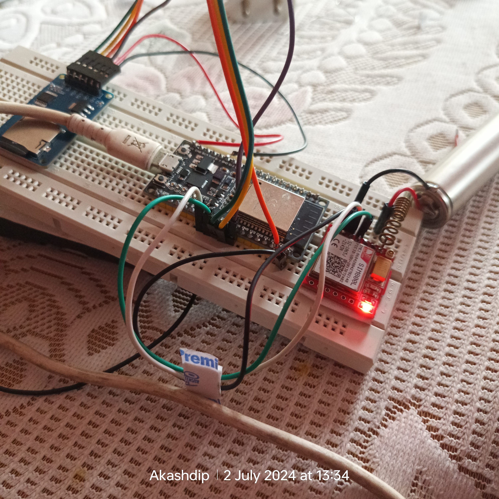
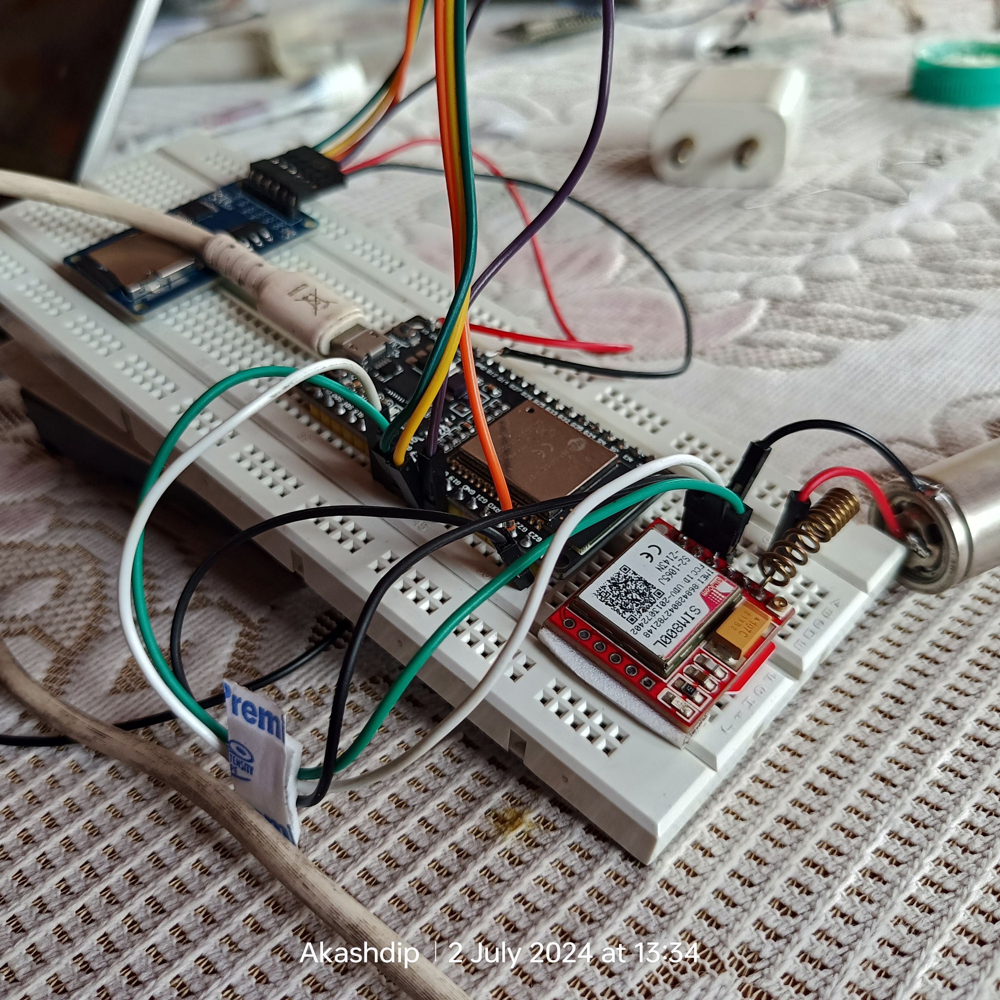
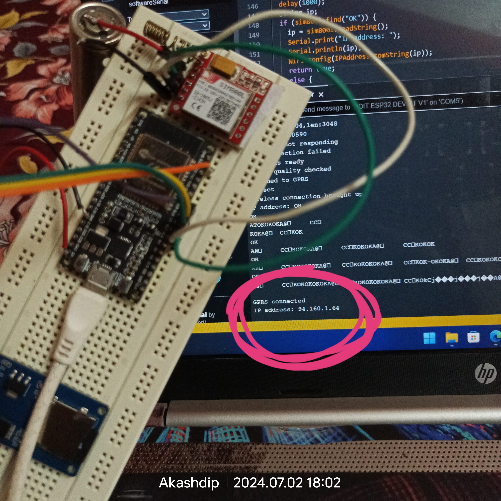
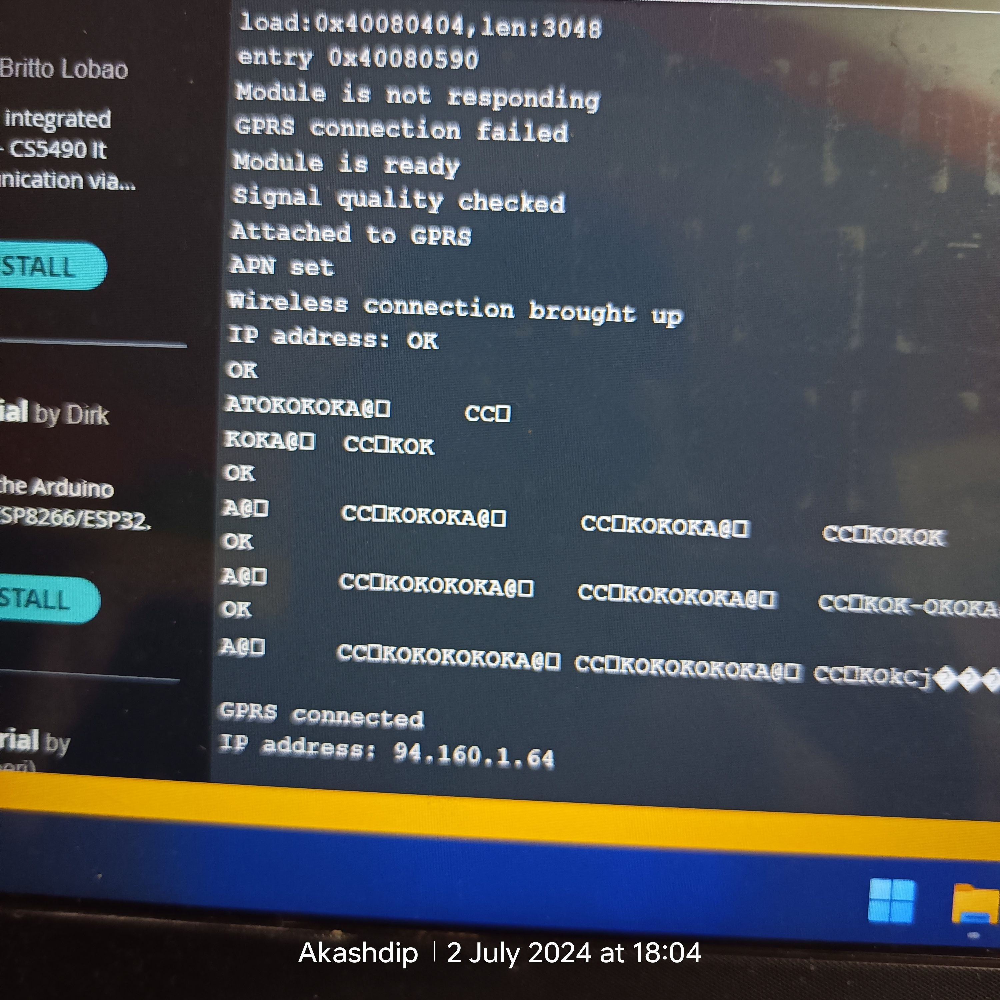

# Diractly connect your SD-card to internet 🛜 using 4G LTE GSM (SIM800L)

<p float="left">
  
  
</p>

To connect your ESP32 to the internet using the SIM800L module and make your website accessible globally, you'll need to configure the ESP32 to communicate with the SIM800L and establish a GPRS connection. Below is an outline of the steps and the modified code to achieve this.

### Requirements:

  - ESP32 board.
  - SIM800L module with a valid SIM card and data plan.
  - Connection wires and power supply for the SIM800L module.

### Wiring:

  - SIM800L -> ESP32VCC -> 3.7V (ensure proper voltage for SIM800L)
  - GND -> GND
  - TXD -> RX (GPIO 16)
  - RXD -> TX (GPIO 17)

### Code:

```cpp
#include <WiFi.h>
#include <SPI.h>
#include <SD.h>
#include <ESPAsyncWebServer.h>

// Pin Definitions for SD Card
#define SD_CS    5
#define SD_SCK   18
#define SD_MOSI  23
#define SD_MISO  19

// SIM800L configuration
#define SIM800L_RX 16
#define SIM800L_TX 17

// Uncomment the appropriate settings for your SIM card
// Jio
const char* apn = "jionet";
const char* gprsUser = "";
const char* gprsPass = "";

// Vi (Vodafone Idea)
 //const char* apn = "vi.internet";
 //const char* gprsUser = "";
 //const char* gprsPass = "";

// Airtel
// const char* apn = "airtelgprs.com";
// const char* gprsUser = "";
// const char* gprsPass = "";

// BSNL
//const char* apn = "bsnlnet";
//const char* gprsUser = "";
//const char* gprsPass = "";

HardwareSerial sim800l(1); // Use UART1 for SIM800L
AsyncWebServer server(80);

void setup() {
  Serial.begin(115200);
  sim800l.begin(9600, SERIAL_8N1, SIM800L_RX, SIM800L_TX);
  
  // Initialize SD card
  if (!SD.begin(SD_CS)) {
    Serial.println("Card Mount Failed");
    return;
  }
  
  // Check if index.html exists
  if (!SD.exists("/index.html")) {
    Serial.println("index.html missing");
    return;
  }

  // Connect to GPRS
  if (connectToGPRS()) {
    Serial.println("GPRS connected");
    Serial.print("IP address: ");
    Serial.println(WiFi.localIP());
  } else {
    Serial.println("GPRS connection failed");
    return;
  }

  // Route for serving files from SD card
  server.onNotFound([](AsyncWebServerRequest *request){
    String path = request->url();

    // Check if SD card is still connected
    if (!SD.begin(SD_CS)) {
      request->send(503, "text/html", "<html><body><h1>SD card not connected</h1></body></html>");
      return;
    }

    // Serve index.html by default if path ends with '/'
    if(path.endsWith("/")) path += "index.html";

    String contentType = "text/plain";
    if(path.endsWith(".html")) contentType = "text/html";
    else if(path.endsWith(".css")) contentType = "text/css";
    else if(path.endsWith(".js")) contentType = "application/javascript";

    File file = SD.open(path.c_str());
    if(file){
      request->send(SD, path.c_str(), contentType);
      file.close();
    } else {
      request->send(404, "text/html", "<html><body><h1>File not found</h1></body></html>");
    }
  });

  // Start server
  server.begin();
}

void loop() {
  // Nothing to do here
}

bool connectToGPRS() {
  delay(3000); // Wait for SIM800L to initialize
  sim800l.println("AT");
  delay(100);
  if (sim800l.find("OK")) {
    Serial.println("Module is ready");
  } else {
    Serial.println("Module is not responding");
    return false;
  }

  sim800l.println("AT+CSQ"); // Signal quality
  delay(500);
  if (sim800l.find("OK")) {
    Serial.println("Signal quality checked");
  }

  sim800l.println("AT+CGATT?"); // Attach to GPRS
  delay(500);
  if (sim800l.find("OK")) {
    Serial.println("Attached to GPRS");
  }

  sim800l.print("AT+CSTT=\"");
  sim800l.print(apn);
  sim800l.print("\",\"");
  sim800l.print(gprsUser);
  sim800l.print("\",\"");
  sim800l.print(gprsPass);
  sim800l.println("\"");
  delay(500);
  if (sim800l.find("OK")) {
    Serial.println("APN set");
  }

  sim800l.println("AT+CIICR"); // Bring up wireless connection
  delay(3000);
  if (sim800l.find("OK")) {
    Serial.println("Wireless connection brought up");
  } else {
    Serial.println("Failed to bring up wireless connection");
    return false;
  }

  sim800l.println("AT+CIFSR"); // Get IP address
  delay(1000);
  String ip;
  if (sim800l.find("OK")) {
    ip = sim800l.readString();
    Serial.print("IP address: ");
    Serial.println(ip);
    WiFi.config(IPAddressFromString(ip));
    return true;
  } else {
    Serial.println("Failed to get IP address");
    return false;
  }
}

IPAddress IPAddressFromString(String ipStr) {
  int parts[4];
  sscanf(ipStr.c_str(), "%d.%d.%d.%d", &parts[0], &parts[1], &parts[2], &parts[3]);
  return IPAddress(parts[0], parts[1], parts[2], parts[3]);
}
```

### ESP32 -> SD Card Module

   - 3.3V -> VCC ,if voltage ⚡ ic present=> use 5 volt
   - GND -> GND
   - GPIO 5 -> CS
   - GPIO 18 -> SCK
   - GPIO 23 -> MOSI
   - GPIO 19 -> MISO
   
### ESP32 -> SIM800L Module

   - 3.7V -> VCC
   - GND -> GND
   - GPIO 16 -> TXD
   - GPIO 17 -> RXD


<p float="left">
  
  
</p>


<p float="left">
  
  
</p>
